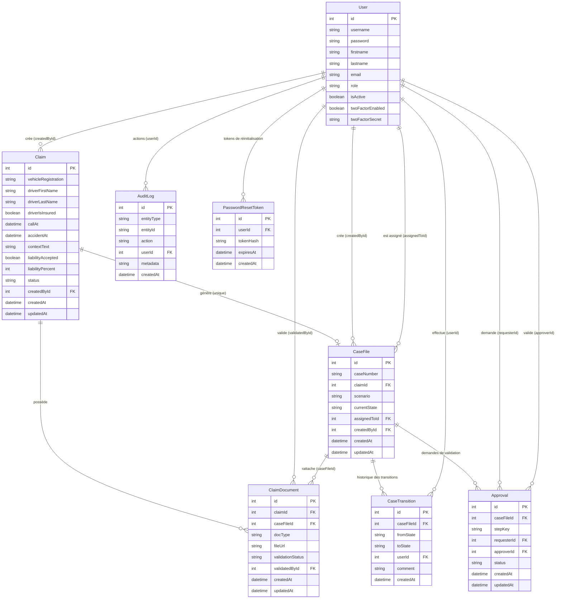

```mermaid
erDiagram
  User {
    int id PK
    string username
    string password
    string firstname
    string lastname
    string email
    string role
    boolean isActive
    boolean twoFactorEnabled
    string twoFactorSecret
  }

  Claim {
    int id PK
    string vehicleRegistration
    string driverFirstName
    string driverLastName
    boolean driverIsInsured
    datetime callAt
    datetime accidentAt
    string contextText
    boolean liabilityAccepted
    int liabilityPercent
    string status
    int createdById FK
    datetime createdAt
    datetime updatedAt
  }

  CaseFile {
    int id PK
    string caseNumber
    int claimId FK
    string scenario
    string currentState
    int assignedToId FK
    int createdById FK
    datetime createdAt
    datetime updatedAt
  }

  ClaimDocument {
    int id PK
    int claimId FK
    int caseFileId FK
    string docType
    string fileUrl
    string validationStatus
    int validatedById FK
    datetime createdAt
    datetime updatedAt
  }

  CaseTransition {
    int id PK
    int caseFileId FK
    string fromState
    string toState
    int userId FK
    string comment
    datetime createdAt
  }

  Approval {
    int id PK
    int caseFileId FK
    string stepKey
    int requesterId FK
    int approverId FK
    string status
    datetime createdAt
    datetime updatedAt
  }

  AuditLog {
    int id PK
    string entityType
    string entityId
    string action
    int userId FK
    string metadata
    datetime createdAt
  }

  PasswordResetToken {
    int id PK
    int userId FK
    string tokenHash
    datetime expiresAt
    datetime createdAt
  }

  %% Relations (cardinalités)
  User ||--o{ Claim : "crée (createdById)"
  Claim ||--o{ ClaimDocument : "possède"
  Claim ||--o| CaseFile : "génère (unique)"

  User ||--o{ CaseFile : "crée (createdById)"
  User ||--o{ CaseFile : "est assigné (assignedToId)"
  CaseFile ||--o{ CaseTransition : "historique des transitions"
  User ||--o{ CaseTransition : "effectue (userId)"

  CaseFile ||--o{ Approval : "demandes de validation"
  User ||--o{ Approval : "demande (requesterId)"
  User ||--o{ Approval : "valide (approverId)"

  User ||--o{ ClaimDocument : "valide (validatedById)"
  CaseFile ||--o{ ClaimDocument : "rattache (caseFileId)"

  User ||--o{ AuditLog : "actions (userId)"
  User ||--o{ PasswordResetToken : "tokens de réinitialisation"
```

